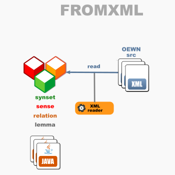

  

  

# OEWN model-from-XML

This reads a model from XML files.

Project [fromxml](https://github.com/oewntk/fromxml)

## Dataflow

## Maven Central

		<groupId>io.github.oewntk</groupId>
		<artifactId>fromxml</artifactId>
		<version>3.0.2</version>
